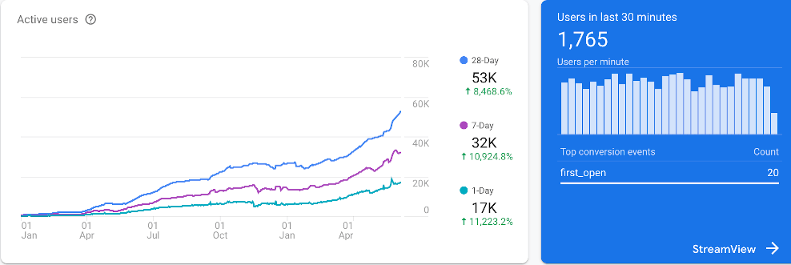

## Our experience leads your business to success

We have specialised in internet security and scalable cloud architecture since 2011. We have built many successful SaaS (Software as a Service) solutions and applications for iPhones and iPads. We advise on cloud security and firewalls. Our base is in London, United Kingdom.

## Our Latest Startup
Our latest start-up Tegant VPN has been the signature of our success. We have poured much of our finest coding abilities into our own SaaS and offer the best possible VPN solutions to our customers.

Below, you will find a chart of how our user base has been growing rapidly since January 2019. 

Tegant VPN enjoys more than 1250 reviews with an average of 4.7 out of 5 stars in the App Store.

## Cloud Stack
We utilise AWS cloud technology for our Restful APIs and make use of various services such as EC2, RDS and Redis, Postgres, Mysql, Nginx and uWSGI to achieve our goals.

## Programming Languages
We create our solutions in Python 3.7, Javascript and Swift 5.0

## Frameworks
Flask, Django, JQuery, Jekyll, SQLAlchemy, Cocoa Touch (iOS) and Cocoa (MacOS) are our favourites.

## Support and Contact
Please get in touch with us at: info@venuscloud.com
